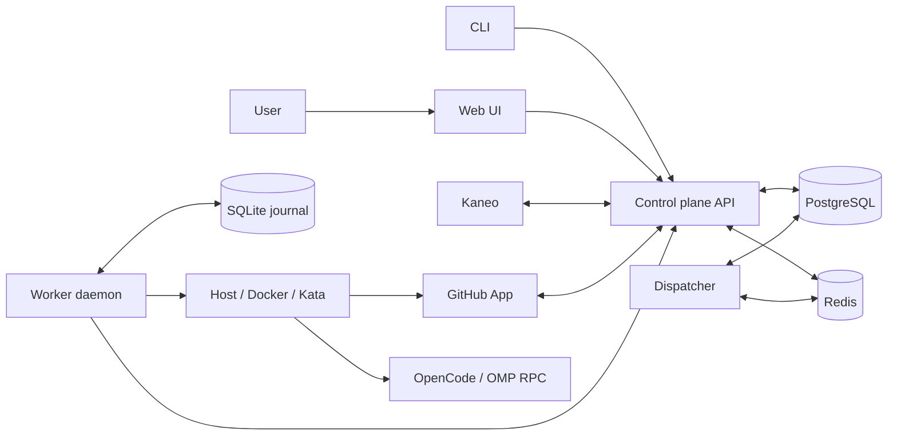

# Architecture

Vulcanum has a control plane, a dispatcher, and one or more workers. External providers connect the control plane to task trackers, models, and GitHub.

## Control-plane processes

### `vulcanum-web`

The Actix Web process listens on port `8000`. It:

- exposes the `/api/v1` API;
- runs PostgreSQL migrations at startup;
- polls enabled task-tracker projects;
- handles users, teams, providers, projects, workers, jobs, and runs;
- receives GitHub callbacks and webhooks;
- stores short-lived coordination data in Redis.

### `vulcanum-dispatcher`

The dispatcher finds pending work. It selects a compatible worker that has free capacity. It reserves a worker slot and sends a signal through Redis.

Run the dispatcher as a separate process. The server container image includes both binaries, but its default entry point starts only `vulcanum-web`.

### Frontend

The Preact frontend calls `vulcanum-web`. It does not connect directly to PostgreSQL, Redis, workers, Kaneo, or GitHub.

## Worker process

The installed `vulcanum-server` binary is the worker daemon. It:

1. Polls the control plane for a job.
2. Acknowledges the job.
3. Records the job in its local SQLite journal.
4. Prepares a host, Docker, or Kata environment.
5. Clones the configured repositories with a short-lived GitHub token.
6. Starts OpenCode or OMP RPC.
7. Reports events and usage.
8. Submits the result.
9. Saves the agent message history.
10. Cleans the execution environment.

The server gives the worker its concurrency limit during registration. The worker uses a semaphore to enforce that limit.

## Storage

| Store | Data |
| --- | --- |
| PostgreSQL | Users, teams, provider settings, projects, workers, work runs, events, usage, pull requests, and encrypted model credentials |
| Redis | Dispatch signals, cancellation signals, registration codes, OAuth state, invites, and webhook work |
| Worker SQLite | Local execution journal for restart recovery |
| Worker filesystem | Agent message history under `~/.vulcanum/sessions/` |

## Run lifecycle

1. A task enters the configured pickup column.
2. The control plane creates a pending implementation run.
3. The dispatcher selects a worker.
4. The worker acknowledges the job. The task moves to the in-progress column.
5. The agent works on the task and submits a result.
6. Vulcanum adds the result to the task.
7. If review automation is enabled, Vulcanum creates one review run for each pull request.
8. The task moves to the review column.
9. When all linked pull requests close or merge, the task moves to the done column.

A failed or blocked run stays failed. Vulcanum does not move its task to the next successful state.

## Trust boundaries

- Host isolation is not a security boundary. The job has the permissions of the worker operating-system user.
- Docker gives a container boundary.
- Kata uses the Docker path with `kata-runtime` and adds a lightweight virtual-machine boundary.
- Model credentials are encrypted in PostgreSQL with AES-256-GCM. The server decrypts the credentials that a job needs and sends them to the authenticated worker.
- GitHub clone access uses short-lived installation tokens.

Use HTTPS between the control plane and remote workers. Use plain HTTP only in an isolated local environment.
